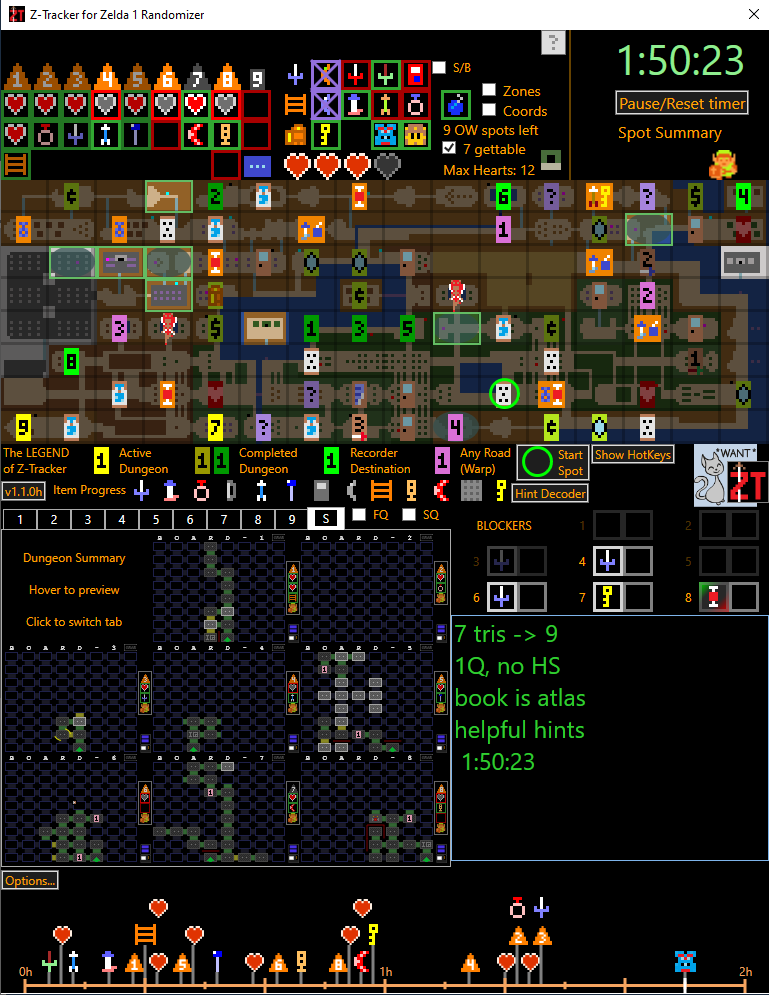
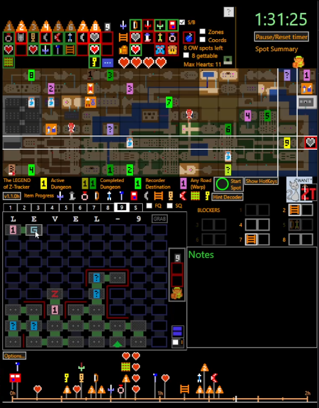

# Z-Tracker

### A tracker for Zelda 1 Randomizer

The most recent release is v1.2.3, and you can find the [documentation here](https://github.com/brianmcn/Zelda1RandoTools/blob/v1.2/doc/TOC.md), which includes links for 
downloading and installing Z-Tracker.

Sample screenshots:

## Motivation

This is a tracking tool for those play seeds of fcouglin's Zelda 1 Randomizer ([z1r discord](https://discord.gg/BEwVJUxxrW), [z1r wiki](https://z1r.fandom.com/wiki/Zelda_1_Randomizer_Wiki), [old z1r site](https://sites.google.com/site/zeldarandomizer/)).

This tool is inspired by [ZHelper](http://questwizard.net/zhelper/), a tool commonly used by z1r racers.  (Other alternatives for tracking z1r include using an EmoTracker pack,
using pen & paper, or using electronic notetaking in spreadsheets/Notepad.)

I wanted to create my own tool that I thought was better suited to certain audiences:

* For **seed runners**: provide a tracking tool with the best visual UI for communicating the relevant information to the player, and the simplest set of gestures for setting data in the UI. 
  This way the player can focus on playing the game, rather than fiddling with the tool to set data, or squinting at the tool to find what they need.

* For **stream viewers**: provide a tracker that immediately communicates the current state of the progress of the run, but also gives a sense of 'how the player got there'. The summary of
  'absolute progress' is always on-screen, as well as a historical timeline that shows when various items were first obtained during the run.  Someone who arrives in the middle of the stream should
  be able to immediately orient themselves via the on-screen tracking info.

* For **those learning z1r**: provide some helpful assistance and steering that makes it easier for the new player to decide what to do next.  Some features help route a path through the overworld 
  to find all of the necessary locations, and others provide reminder feedback about item progress and places that ought to be returned to, to finish the seed.

Z-Tracker is still in active development as I write this (August 2022).  The current release is suitable both for casual seed runners as well as z1r racers.
