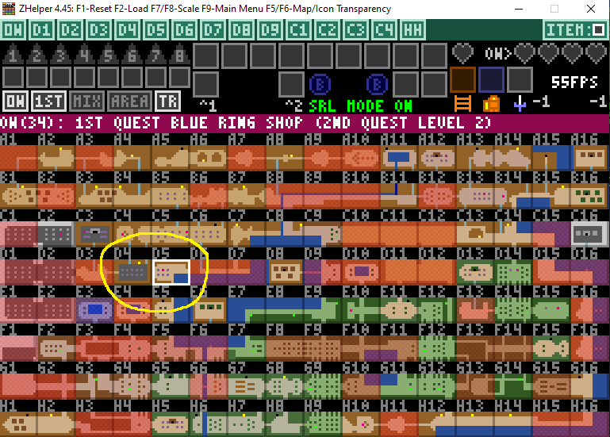
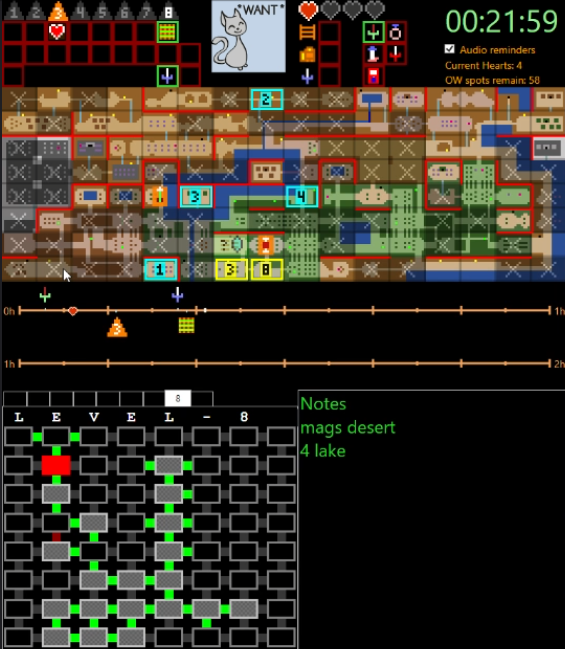
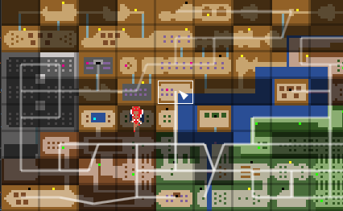
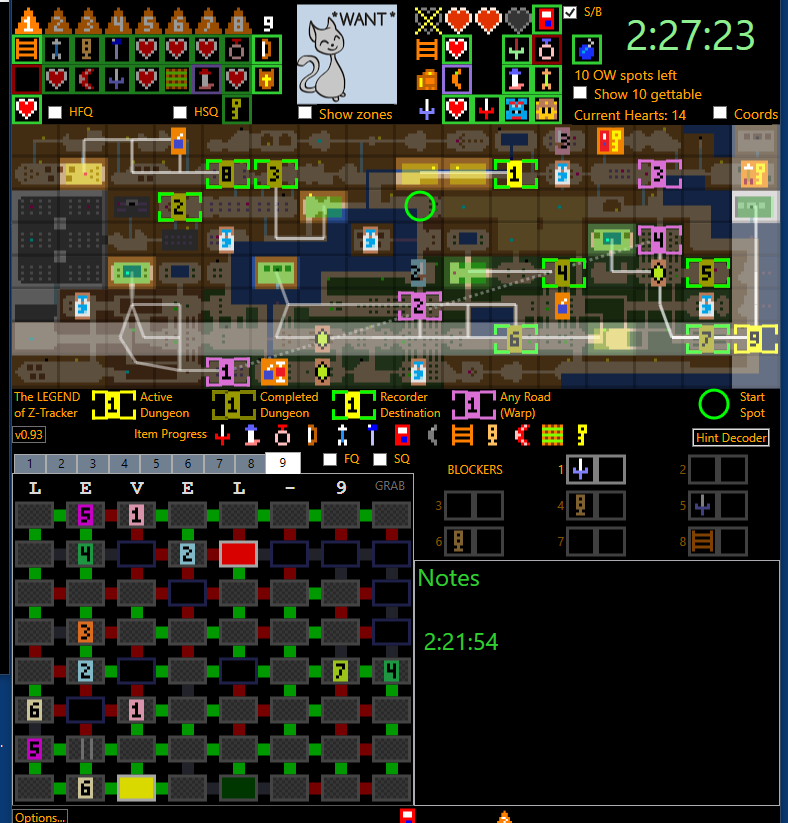
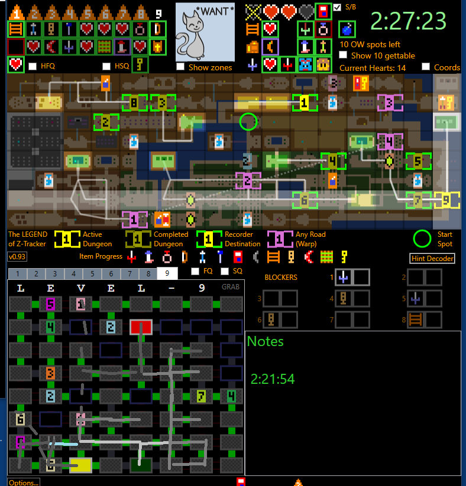
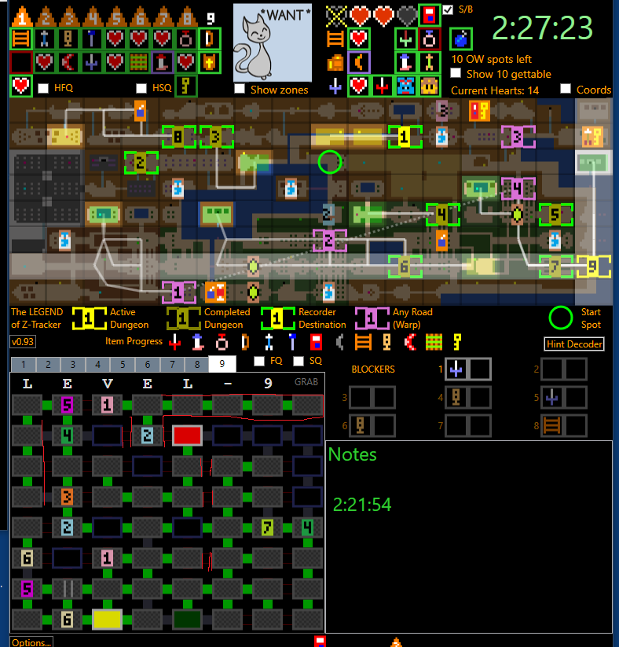
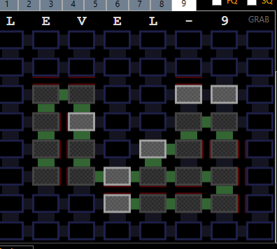
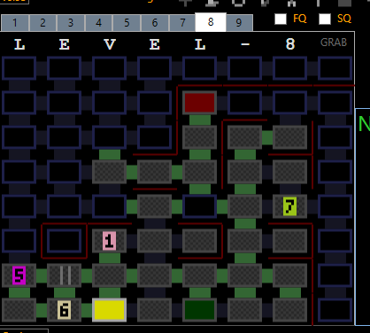

# About Z-Tracker and the people who made it

Z-Tracker was developed principally by Dr. Brian Lorgon111 ([twitch](https://www.twitch.tv/lorgon), [YouTube](https://www.youtube.com/c/lorgon111)).

That's me.  Hi!

I did nearly all of the coding, most of the UI design, and most of the pixel art.

There are a number of other noteworthy contributors to this project:

 - marcmagus is basically a co-designer of the UI, having given almost-daily feedback on the tool over the last couple months; he has also done a little coding, a bit of pixel art work,
   and is the tester of the Linux version
 - Questwizard is the author of ZHelper, the tool which inspired Z-Tracker, from which I borrowed much of the early pixel art and early overall design
 - homerjsmash gave extensive feedback on an early version of the tool which influenced many aspects of the design
 - Kigalas and abraxas were beta testers who gave a lot of feedback and found a number of bugs
 - many viewers of my twitch streams who watched me play z1r with alpha/beta versions of the tool and gave me direct feedback
 - many z1r players whose streams I lurked in, so I could watch them use ZHelper and note what mistakes they made or trouble they had

# A brief history of Z-Tracker

I originally developed Z-Tracker using F# (a very nice programming language for .NET, and what I know best) and WPF (the .NET Windows library for UI and drawing stuff on the screen).

If I remember my original motivation correctly, it was that I was playing z1r using ZHelper, but struggling to navigate the overworld map.

The two circled tiles appear to be very close to one another, when in fact it is quite a long walk from A to B!

A map display that helped me better see how to get from screen A to screen B was the original feature of the application which would eventually become Z-Tracker.  I don't have any videos 
or screenshots of the very early days, but here is a screenshot from Feb 2021, where you can see I drew 'red walls' on the map to help me see where I could not go:

(There's also an early version of the Timeline there, as well as a very primitive dungeon tracker.)

At some point I had the idea to actually capture the full overworld map topology and programmatically compute all the possible walking routes, which was the first _really_
interesting/novel thing I did with the tracker, and that feature survives today as the 'routing' lines that are drawn as you mouse hover the map:

While the project had existed for a few years (I first began some work on it in late 2019), the vast majority of its development came in Aug/Sep/Oct of 2021, as you can see 
[here](https://github.com/brianmcn/Zelda1RandoTools/graphs/code-frequency).  That's because in late July 2021, my friend Marc had watched my z1r streams and wanted to use 
my tracker.  A new user!  Cool!

Except Marc runs Linux, and Z-Tracker was developed for WPF, which only runs on Windows.  Darn!

Around that time, the delta variant of COVID-19 starts its rampage across the US, and I find myself sitting at home alone a lot.  With this free time, I decide to look into
trying to port the tracker so it can run on Linux.  I discover a library called Avalonia, which is very similar to WPF but cross-platform.  With some effort, I get (most of)
the code ported (with some bugs), and Marc can run it!  We start chatting almost daily about the tracker and randomizers; it turns out Marc has development experience in this
area as well, and shares most of my design aesthetic.  A productive collaboration is born.

On the first day Marc has the tracker running on Linux, he suggests keyboard shortcuts for marking overworld map tiles.  It will be 10 weeks until I deliver that feature, I
want to focus on the speech recognition capability first - at this time, the tracker uses only mouse scrollwheel and has no popups.

In mid-August, Marc suggests a pop-up menu for choosing items/tiles quickly rather than just scrolling.  I like the idea but don't know if I am up to the challenge of 
implementing it... Z-Tracker is by far the most user-interface-y coding project I have worked on; at the start of it, I barely knew how to put a Button or TextBox on the screen.
Four weeks later, I get popups for item boxes working, and over the next month, refactor the code so overworld tiles, blockers, and dungeon rooms can also use popups for
mouse-selection among many choices.  Overworld tiles in particular required redesigning new, slimmer icons, rather than the full-tile icons I had copied from ZHelper.

Over the next couple months, we discuss how to best cram all the tracker info into the available screen real estate, Marc tidies some pixel art and improves colors/contrast,
I add an overworld magnifier and Marc suggests adding a pixel grid overlay, I draw slim icons for shops so I can fit two of them in a tile, I re-work the timeline to fit on one line,
I implement GRAB (cut and paste) for dungeon segments, I add the Options Menu, I add Mirror Overworld support, get a couple new beta testers, I add middle-click dungeon rooms,
I add Hint Decoder/Halo and Blockers to reduce need for "Notes" (to make tracker more friendly to mouse-only), Marc reworks the neglected startup screen, there is MUCH iteration 
regarding exactly how left-click, right-click, and scrollwheel work in various popups to optimize the common cases... every aspect of the tracker gets a lot of design and iteration
as we put it through the paces.

Here's one detailed example of design iteration.  I played a z1r seed and got totally 'lost' in this dungeon 9, unable to use my map to find my way from A to B:

So after-the-fact, I try to imagine how it could have looked on the screen to make it easier to find my way.  The red 'no go' doors were not helping, so I blacked them out.
Path drawing, like on the overworld?

I want the actual dungeon-map-topology to visually "pop"", what about red lines against walls to visualize no-can-go?

I implement a prototype:

Marc suggests the final tweak that makes the topology really pop:

(In retrospect, odd that I didn't think of the 'draw red walls' solution, when it was literally the first thing I made the tracker do in the overworld many months before!)

And so it went.  Another month of adding more features, iterating, and polishing, and the tracker finally feels 'ready for the world' as I write this (2021-Oct-21).  I hope you 
(and your viewers) enjoy using (and watching) it!  --Brian

**EDIT in August 2023**: wow, the app has come so far in the last couple years.  So many more features, and greatly improved usability across a variety of devices.  Thanks to 
many users (too many to name) who helped over the years by testing, reporting bugs, offering feature suggestions, and discussing design ideas.

