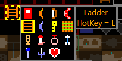
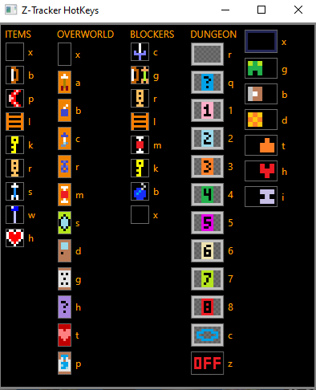
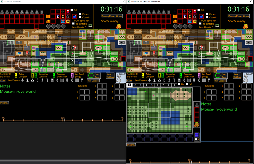
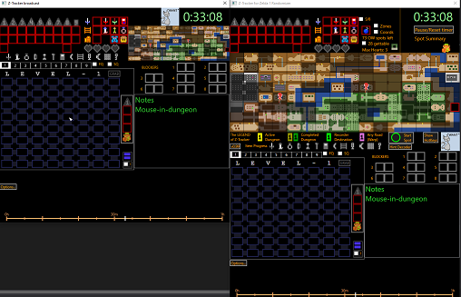

# HotKeys, save state, and extra windows

Contents of this document:

  - [HotKeys](#hotkeys)
  - [Save State](#save-state)
  - [Broadcast Window](#broadcast-window)
  - [Window Size](#window-size)

##  HotKeys

You can bind hotkeys (any keyboard keys) by editing the HotKeys.txt file in the Z-Tracker folder.  The text file format is self-describing.

There are seven mouse-hover 'contexts' for hotkeys: [item boxes](use.md#item-boxes), [overworld tiles](use.md#main-owm), [blockers](use.md#main-blockers),
[dungeon rooms](use.md#main-dr), ['Take Any' and 'Take This'](use.md#take-any-accelerator) menus, and finally a 'global' context, used both for toggling
the boxes in the [other item area](use.md#main-oia) and for switching dungeon tabs via a hotkey.  The non-global contexts can each map the same keys, so 
for example 'b' could be set up to mean 'bow' when the mouse is over an item box, 'bomb shop' when the mouse is over an overworld tile, 'bow & arrow' when 
the mouse is over blockers, and 'bomb upgrade room' when the mouse is over a dungeon room.  Any hotkeys in the global context must be unique (not bound 
in any other context, with the exception that TakeAny and TakeThis can override globals when those menus are on-screen).

While there is no support for editing or reloading hotkey information inside the application, Z-Tracker does provide ways to display your current hotkey
information.  First, each popup menu will display any hotkeys that have been bound, alongside the description in the mouseover popup:

Second, you can left click the button 'Show HotKeys' to the right of the overworld map legend, and it will create a new, resizable, window displaying your hotkey
mappings.  You can choose to leave that window wherever you like on your desktop as a 'cheat sheet' when trying to learn your hotkeys; close the hotkey
display window at any time when you are done with it.  The window size and location will persist across sessions.  If the window ever becomes inaccessible 
off-screen, you can right-click the 'Show HotKeys' button to re-position and re-size the window to a default location on-screen.

Hotkeys only work when the Z-Tracker window has focus.  If your hotkeys don't appear to be working, click somewhere in the app window (other than inside
the [Notes text box](use.md#main-notes)) to ensure that window has focus, and then try again to mouse hover an empty item/overworld/blocker/dungeon box and press
a keyboard hotkey.

Hotkeys have some 'smarts' in addition to just 'setting the state you pressed':

 - item boxes
    - repeat presses of the same item will cycle the red-green-purple of the box outline, so for example is 'b' is bow, then 'bbbb' on an empty box would go
      empty box -> red bow -> green bow -> purple bow -> red bow

 - overworld
    - on an item shop, pressing a hotkey of an item already-in-a-shop will remove that item from the shop
    - on an item shop, pressing a hotkey of a different item, when the shop has an extra space, will add that item to the shop
    - on an item shop, if the shop is filled with two items, pressing a third item's hotkey will replace the first item
    - on tiles with a [brightness toggle](use.md#ow-map-tile-brightness), repeat hotkeys will toggle between "bright" and "dark" versions of the tile icon

 - blockers
    - a repeat hotkey toggles a blocker box back to empty

 - dungeon rooms
    - a repeat hotkey toggles a RoomType, MonsterDetail, or FloorDropDetail back to Unmarked

These ad-hoc behaviors are designed either to make common cases fast and easy, or to make it easy to correct mismarks from 'fat fingering'.

##  Save State

You can save the current state of the tracker to a file, and load it again (say, tomorrow) to pick up a seed where you left off.

Click the 'Save' button in the running tracker to save all of the current tracker state; it will automatically be saved to a file with the current date and time in the filename.

On the startup screen, choose the 'Start: from a previously saved state' option to load up a prior save.

##  Broadcast Window

On the [Options Menu](use.md#main-om), you can opt into a 'broadcast window'.  This causes a separate, not-as-tall (squarer) window to appear; the new window is designed 
for stream-capture, for streamers who think the Z-Tracker app is too tall for their stream layout.  The broadcast window switches dynamically between two possible displays: 
one is overworld-focused, and the other is dungeon-map focused.  The broadcast window will automatically switch between views depending upon if your mouse is in 
the upper portion or the lower portion of the main Z-Tracker window.  The broadcast window is not interactive - it does not respond to mouse clicks, and is 
only a display.  Thus, you use the main Z-Tracker window exactly as your normally would, but rather than have your stream capture the main, tall, interactive Z-Tracker 
window, you instead capture the shorter Broadcast Window, and it will automatically show the correct subset of the view to your viewers, based on your mousing.

sample display when mouse in upper portion:

 

sample display when mouse in lower portion:

The broadcast window also has an option to be 2/3 size or 1/3 size (512 or 256 pixels wide, rather than 768 pixels wide).  
Capturing these exact sizes 1:1 in your stream layout can help keep a bit of the pixel art 'crisp' in a smaller area for your stream, and may look better than 
using OBS to downscale your screen capture of the broadcast window to some arbitrary-but-similar size.

If you do use the Broadcast Window, be sure to read the [Stream-Capturing Z-Tracker with OBS](stream-capture.md) document for a number of useful tips.

##  Window Size

The Z-Tracker application is somewhat large (the window content is 768x967), designed to make all of the important information available to the player on-screen 
at once.  However some users may need or desire a smaller application window.  You can make the application window 2/3 size by clicking the button in the banner strip at the 
very top of the startup screen, which allows you to select either the Default or 2/3 size options.

