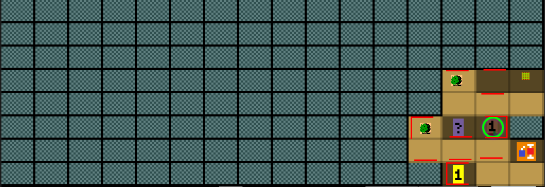
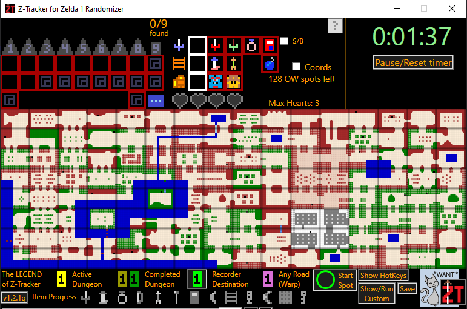
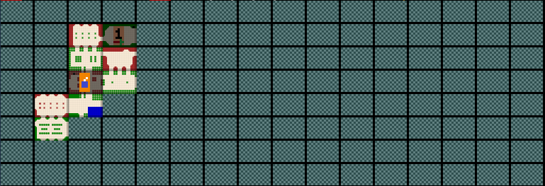
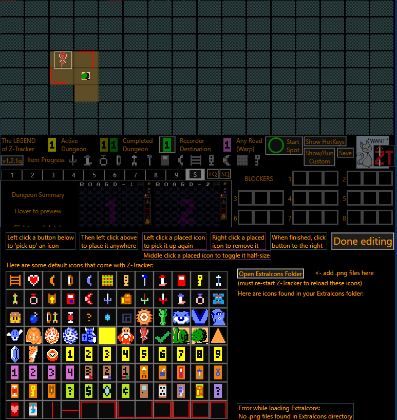
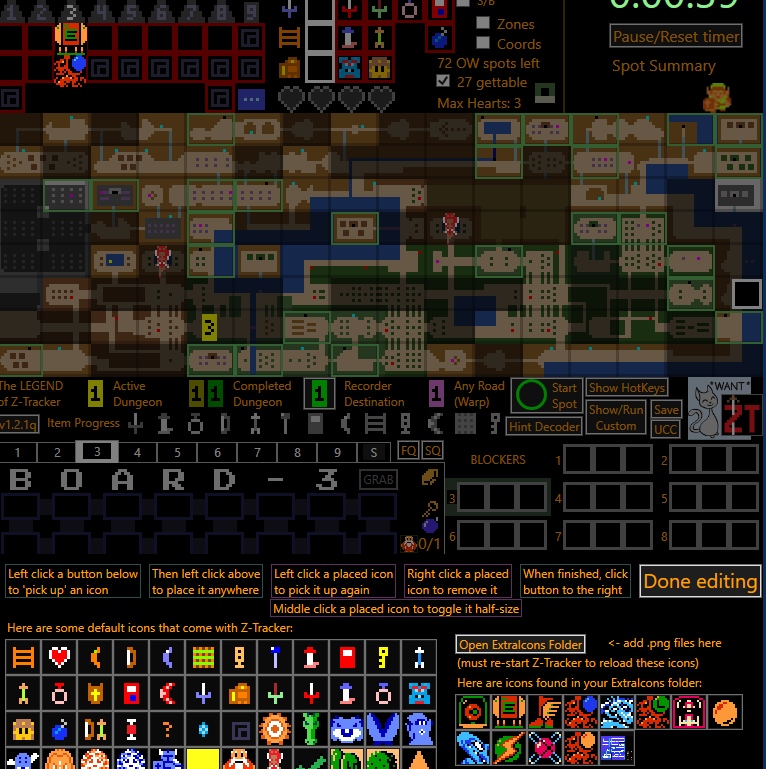
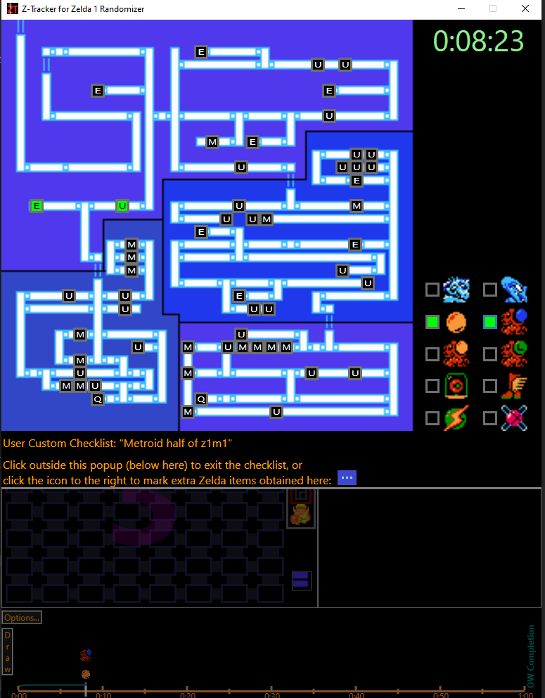

# Using Z-Tracker for other Zelda randomizers/ROMHacks

Z-Tracker was designed for use with fcoughlin's Zelda 1 Randomizer (z1r).

Nevertheless, Z-Tracker does have features and extensibility that can make it effective for playing other randomizers and ROM-Hacks, including

 - z1m1 (Legend of Zelda Metroid Crossover)
 - Infinite Hyrule
 - Zelda Reloaded
 - Shin Zelda Densetsu
 - Hellwalker
 - ...

There are 3 main Z-Tracker features that enable it to be used effectively with a variety of other Zelda games:

 - [Alternative overworld maps](#alt-ow) - a feature for loading custom overworld maps, or a blank map that you draw, rather than standard Hyrule
 - [Draw](#draw) - a feature for drawing arbitrary icons atop the tracker
 - [User Custom Checklist](#ucc) - a feature for tracking and timeline-ing a list of things outside Zelda (e.g. the Metroid half of z1m1)

Each is described in turn below.

## Alternative overworld maps

On the Z-Tracker startup screen, to the right of the 'First Quest Overworld' button there is a button labeled '...' which brings up the options for
alternative overworld maps.  There are 3 choices for the overworld map:

 - a blank 16x8 grid (you can draw your own map as you go)
 - select a map file from disk, and have it fully revealed at the start
 - select a map file from disk, but have each tile hidden until it is clicked

Here's an example of what the blank 16x8 grid looks like, early into a game of Shin Zelda Densetsu and drawing my own map:

And here's an example of Zelda Reloaded with a fully revealed map:

or with tiles only revealed as the player explores and clicks them:

## Draw

In the lower left of the Z-Tracker window, there is a button called 'Draw' which lets you draw arbitrary icons on the upper portion of the tracker.
When you click 'Draw', instructions explain how to place arbitrary icons on the tracker:

Z-Tracker comes with a default set of icons which you might find useful for adding extra annotations to your maps.  You can also add your own icons
by placing them in the ExtraIcons folder under your Z-Tracker installation.  Here's an example with Metroid icons being used to mark that the player
found an Energy Tank and the Ice Beam in dungeon 3:

## User Custom Checklist

You can keep an arbitrary "checklist" inside Z-Tracker using the User Custom Checklist feature.  A checklist is a background image, and a number of 
labeled "checkboxes" which the player can click on to turn green.  Each checkbox can optionally choose to populate the Z-Tracker timeline when it is
checked.

Here's an example of a User Custom Checklist for z1m1:

The background image is a map of Zebes with each item location being a checkbox, and there is also a list of major items on the right which can be
checked to add them to the Z-Tracker timeline.  You can obtain this checklist here:

https://github.com/brianmcn/Zelda1RandoTools/blob/v1.2/UserCustomAssets/z1m1ExtraIcons.zip

Just unzip all the files into your ExtraIcons folder.  The checklist metadata is a simple .json file.
