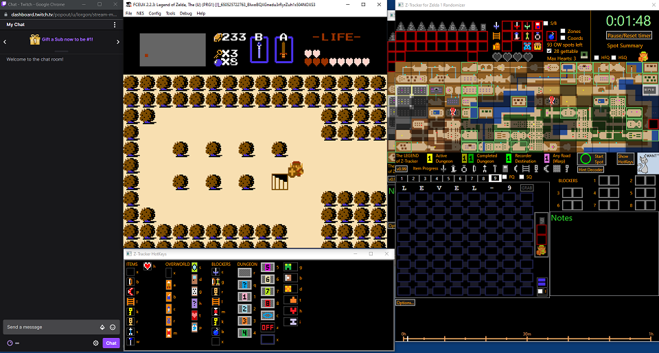

# Stream-Capturing Z-Tracker with OBS

You should use OBS 'Window Capture' to capture the Z-Tracker window for streaming.  

For best results, set the 'Window Match Priority' to 'Window title must match'.

Be sure that your emulator does not need window focus (e.g. in FCEUX Config, Enable 'Run in Background' and 'Background Input'), as Z-Tracker requires window focus to
respond to mousing and hotkeys.

### For those using the Broadcast Window...

Read the [Broadcast Window section](extras.md#broadcast-window) for more capture and sizing options.  If you do use the Broadcast Window, then you should probably turn OFF the
'Capture cursor' checkbox in the OBS Window Capture of the Broadcast Window (the Broadcast Window displays its own virtual mouse cursor as window content).  If you capture the Z-Tracker 
main app window directly, then you should probably turn ON the 'Capture cursor' checkbox in the OBS Window Capture of the main app window, so that viewers can see 'where you are',
as typically during normal gameplay, your cursor will naturally be resting on or near a dungeon room or overworld map tile where you currently are.

OBS can typically only capture windows that are drawn on the screen.  This means that you should not minimize the Broadcast Window, nor should you have any part of it 'off your desktop'.
Since the streamer's physical display real estate is typically at a premium, one of the best places to place the Broadcast Window on your desktop is _behind_ the main application window.
This way it remains on the drawing surface of your desktop (to get drawing updates that OBS can capture), but also does not take up extra visible screen real estate (since it's behind another 
window).  Here is an example:

(In this example, OBS and my twitch channel dashboard are on a second monitor.)  The main application window is fully visible to the streamer on the right hand side.  Just slightly down 
and left of it, you can see the Broadcast Window peeking out from behind.  Leaving an edge peeking out makes it possible for the streamer to see at a glance if the upper 'overworld view' or 
the lower 'dungeon view' is currently being broadcast on stream.

