# Main gameplay features of Z-Tracker

This document has detailed notes about the main UI features of Z-Tracker.

Z-Tracker has two versions - one runs on Windows and one runs on Linux.  The two versions are very similar, but have some minor differences.  
Some features are only available for the Windows version; these features will be labeled as 'WPF only'.

Contents of this document:

- [General Features](#general)
  - [Popups](#general-popups)
  - [Green-Yellow-Red Highlights ("GYR")](#general-gyr)

- [Main Z-Tracker Window](#main)
  - 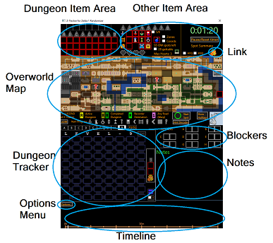
  - [Dungeon Item Area](#main-dia)
    - [Starting Items or Extra Drops](#main-sioed)
  - [Other Item Area](#main-oia)
  - [Link (specific routing)](#main-link)
  - [Overworld Map](#main-owm)
  - [Dungeon Tracker](#main-dt)
  - [Dungeon Rooms](#main-dr)
  - [Blockers](#main-blockers)
  - [Notes](#main-notes)
  - [Timeline](#main-timeline)
  - [Options Menu](#main-om)

- [Speech Synthesis (voice reminders)](#speech-synthesis)
- [Speech Recognition](#speech-recognition)


# <a id="general"></a> General Features

A few commonly-recurring features used throughout the tracker are explained here.

## <a id="general-popups"></a> Popups

Z-Tracker uses popups extensively.  Many types of elements (items, map tiles, dungeon rooms, ...) have lots of possible choices to scroll through; 
to better visualize all the options, scrolling the mouse-wheel instantly brings up the popup to see all the choices.  You can either just continue 
scrolling, and then click once you have reached your desired choice, or you can mouse over the grid of choices and click the one you want (mousing 
is often faster when there is a very long list of choices, such as the overworld map tiles).  Clicking outside of a popup will cancel the popup 
and abort making any changes to the element.

When mouse-hovering an element with choices, scroll-wheel always activates the popup.  
In certain cases noted below, clicking also activates the popup.

## <a id="general-gyr"></a> Green-Yellow-Red Highlights ("GYR")

A number of features will highlight tiles on the overworld map to help you quickly visualize locations.  The highlights appear as rectangles around
overworld map tiles, and they come in three colors:

 - A **green** rectangle highlights a location the player can access now, based on their current inventory.  For example, if Recorder Lake were
   being highlighted, it would be highlighted green if the player currently has the Recorder.

 - A **yellow** rectangle highlights a location the player can access now, based on the current inventory, however it may not actually house an 
   entrance in this seed (mixed overworld quest).  For example, while the screen West of the vanilla start spot can always be bombed to reveal a cave
   entrance, the screen North of the vanilla start spot sometimes will and sometimes will not be bombable (in mixed overworld quest).

 - A **red** rectangle highlights a location the player cannot access now, based on their current inventory.

To illustrate, here is how the tiles near the vanilla start spot appear, in a mixed overworld quest, when the player has marked that they have bombs
but do not yet have a candle, and the "OW spots left" is mouse-hovered to highlight remaining spots:

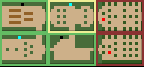

# <a id="main"></a> Main Z-Tracker Window

## <a id="main-dia"></a> Dungeon Item Area

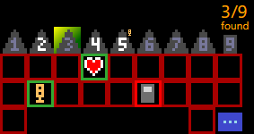

**Triforces:** Click to toggle whether you have a triforce.  Triforces start out darkened, and light up orange when you get them.

The triforce display suggests if dungeon has been located on overworld map: 

 - gray numeral means un-found
 - white numeral means location known
 - highlighted background means have [helpful location hint](#helpful-hint)

Mouse-hovering the triforce will highlight the dungeon's (possible) location(s) on the map if known (or hinted).

If the dungeon location is known to be an overworld spot blocked by Raft/PowerBracelet/Ladder/Recorder, a tiny icon of that blocker appears in its 
upper right.  This is to help keep track of things if playing using the "Force Overworld Block" flag setting of the rando.

<a id="item-boxes">**Items:**</a> The list of possible items (Book, Boomerang, ...) appears in a popup.  
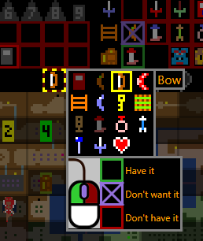

Choose the item to populate a box, and

 - left click marks it Green, to denote that you have this item in your inventory
 - right click marks it Red, to denote that you do NOT yet have this item (e.g. you got a helpful hint that the Book is in 6)
 - middle click marks it Purple (with X), to denote you intentionally are skipping this item (see below)

Red-boxed, not-yet-gotten items appear in grayscale, to help emphasize that they are missing and constitute remaining work.

In addition to scrolling, clicking an empty item box will activate the popup.  Repeat-clicks (e.g. a left-click on a box you have, or a right-click 
on a box you don't have) on a non-empty item box will also activate the popup.

The purpose of being able to mark items as 'skipped' is so that the various reminder systems will quit pestering you (about, for example, the 
boomerang you intentionally left behind on the coast), while still accurately capturing your true 'item progress' on the screen for viewers.

Most item progress has semantic meaning to the tracker with regards to routing/reminders/etc as described below.

Note: while you can interact with Triforces and Items in the Dungeon Item Area, in practice you will instead typically interact with these in 
the [dungeon inset](#dungeon-inset), which provides a duplicate view of each column.

### <a id="main-sioed"></a> Starting Items or Extra Drops

If the flagset you are playing with uses any Starting Items, uses Shuffle Minor Dungeon Drops, or uses Make Important Item Drops (from monsters),
then there is no obvious place to track these items in the main tracker.  Instead, Z-Tracker has an 'extras' popup to track these extra items, 
which you can access by clicking on the blue ellipsis icon in dungeon 9's column:

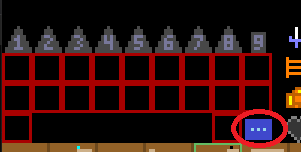

Clicking the elllipsis pops up a display like this:

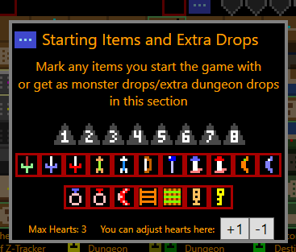

So for example, if you started with triforce 3, the red candle, and 4 starting hearts, you could click a triforce, candle, and +1 max hearts, and
see the changes reflected here (note how you can see triforce 3 light up on the main tracker, the red candle light up in the Item Progress bar, and
the max hearts changed in the upper right of the tracker).  For convenience, the triforce-decoder-diagram appears alongside this popup, to help you
figure out which triforce piece was in your starting inventory:


Note that you can also use the max-hearts feature here to reduce your maximum hearts, e.g. if a 'Money or Life' mugger steals one in a dungeon.

## <a id="main-oia"></a> Other Item Area

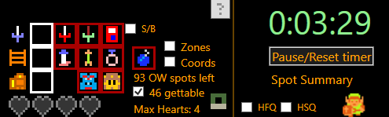

**White Sword Item, Coast Item, Armos Item** - behave just like dungeon item boxes, and are typically interacted with [from the overworld map](#item-box-on-ow-map)

- If the white sword cave location is known to be an overworld spot blocked by Raft/PowerBracelet/Ladder/Recorder, a tiny icon of that blocker appears 
  in its upper right.  This is to help keep track of things if playing using the "Force Overworld Block" flag setting of the rando.

**Magical Sword, Wood Sword, Blue Candle, Wood Arrow, Blue Ring** - click these when you get them, so they appear on the [Timeline](#main-timeline)

**Bombs** - click when you get bombs, to have map [routing](#routing) send you to bombable locations

**Boomstick Book** - click when you get it to mark the timeline, and click S/B to toggle whether Shield or Book icon is available as a dungeon item

**Ganon/Zelda** - click when you kill ganon or rescue zelda, marks timeline; clicking zelda will also post your finish time as text in the NOTES section and pause the timer

**4 take-any hearts** - click or scroll to say you took a heart container (red heart) or chose another option (X); rather than mark these directly, these are 
typically interacted with via the [take any accelerator](#take-any-accelerator) on the overworld map

**Zones** - click checkbox or mouse-hover to show overworld map zones, as hinted by randomizer NPCs for locations

**Coords** - click checkbox or mouse-hover to show a coordinate overlay

'N' OW spots left - Displays a count of all remaining, unmarked spots.  Mouse-hovering shows them all with [GYR highlights](#general-gyr).

'N' gettable - Displays a count of how many of the remaining unmarked spots are 'gettable' based on the player's current inventory.  Click the checkbox 
or mouse-hover to show all the remaining unmarked overworld tiles you could uncover given your current item set, using [GYR highlights](#general-gyr).

Max Hearts: 'N' - Displays the current number of heart containers the player has.  (Useful as a double-check that you have correctly been marking take-any
hearts and heart containers found in the world.)

Open Cave Icon - Mouse-hovering the open-cave icon will highlight any open cave locations you have not yet marked, using green [GYR highlights](#general-gyr).

Timer - Displays the amount of time you have spent on the seed

'Pause/Reset timer' button - Click this to pause the timer.  You will then be given options to click on, to either resume or reset the timer.

<a id="spot-summary">'Spot Summary'</a> - Mouse-hovering 'Spot Summary' displays all the possible overworld locations that can be found, graying out the subset you have already found.
This makes it easy to get an overview glance at what remains to be found, or see e.g. how many large secrets or door repair charges remain, if
you have been marking those diligently.

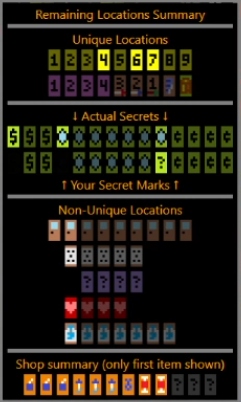

<a id="hfq-hsq">HFQ/HSQ buttons</a> - If the rando flagsset is not known a priori to be 1st/2nd/mixed overworld, you should select mixed-2nd at startup, and then use the
Hide First Quest or Hide Second Quest buttons later if later helpful.

Many of the items in this area have behaviors when hovered with the mouse:
- Mouse-hovering the wood/white/magical sword icons will highlight their cave's (possible) location(s) on the map if known (or hinted).
- Mouse-hovering the boomstick book icon will highlight its shop location on the map, if known.
- Mouse-hovering blue_ring/wood_arrow/bomb icon will highlight all its shop locations on the map.
- Mouse-hovering blue_candle icon will highlight all its shop locations on the map if you don't yet have a candle; otherwise it highlights burnable trees.
- Mouse-hovering the armos icon will highlight any armos locations you have not yet marked up.
- Mouse-hovering the power-bracelet/ladder/raft/recorder/redcandle in your inventory or in the ['item progress' bar](#item-progress) will 
  highlight any push-block/ladderable/raftable/whistleable/burnable locations you have not yet marked up.


## <a id="main-link"></a> Link (specific routing)

Link is here to help guide you on your quest!  Click on Link, select a destination, and the best path(s) from your mouse cursor to the destination
will be shown on the screen for the next ten seconds.

Link's possible destinations include:
 - a specific overworld tile
 - shops of a certain type (e.g. any bomb shops you have marked)
 - dungeons
 - white/magical sword cave
 - remaining open caves (typically for a "wood-sword hunt")

Link can even deal with ambiguous locations, for example, if dungeon 3 was hinted to be 'by a lake', you can have Link route you there, and he will
show routes to all the remaining accessible lake destinations, as well as highlighting other inaccessible locations (e.g. because you don't have 
the raft and can't reach the middle of the lake) using [GYR highlights](#general-gyr).


## <a id="main-owm"></a> Overworld Map

The overworld is a 16x8 grid of overworld map tiles.  You can choose a mark for each tile using the popup.  In addition to scrolling, right-clicking 
an unmarked map tile will activate the popup.  Left-clicking a "dark" tile will also activate the popup.  Here is a screenshot of the tile icons:


and here are their meanings:

 "icon"       | description
 -------------|-------------
 "1-9"        | dungeons
 "1-4"        | any roads (stair warps)
 "sword3/2/1" | magical sword/white sword/wood sword item cave
 (items)      | item shop
 "green"      | secrets: "?" unknown, "$" large, "rupee" medium, "¢" small
 "door"       | door repair charge
 "dice"       | money making game
 "letter"     | the potion letter cave
 "armos"      | armos item location (can only be in 5 spots)
 "purple?"    | hint shop, or white/magical sword hint
 "heart"      | cave to "take any one you want"
 "potion"     | potion shop
 "dark"       | nothing, or don't care

Left-clicking an unmarked map tile will mark it 'dark', as an accelerator for marking don't-care spots.

Left-clicking an item shop pops up choices for a second item in the shop (max of 2 items).  

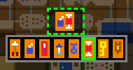

Right click a shop to change the first item (whole tile popup).

Left-clicking toggles the <a id="ow-map-tile-brightness">brightness</a> of some icons; "bright" means somewhere you might return to later; "dark" means you are done with the location.
 - take-any, wood-sword-cave, hint shops, and large/medium/small secrets are all examples of these, where you might walk away and return later

Some map tiles have accelerators.  For example, <a id="take-any-accelerator">when selecting the 'take any heart' map tile</a> from the popup grid (or via speech), the take-any
accelerator will pop up, with 4 choices (take potion, take candle, take heart, take nothing).  Your selection may have multiple effects, for 
example, choosing the candle will (1) 'X' out one of the take-any hearts in the top of the tracker, (2) mark that you have a blue candle in the top 
of the tracker, and (3) mark the overworld map tile as a 'taken' take-any-heart.  The accelerator is a pie menu that pops up in the middle of the
window and warps your mouse cursor to the center, so you can quickly make a selection with a small mouse movement and a click.  After making the
selection, your mouse cursor is warped back to the overworld tile you started at.  Using the accelerators is simple and intuitive; reading this
paragraph was comparably more difficult and time-consuming.

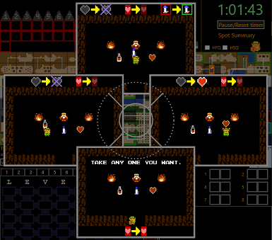

<a id="item-box-on-ow-map">An unclaimed</a> White-Sword- or Coast- Item will appear on Sword2 and Coast map tiles, for convenience.  Marking the Armos tile provides an instant
accelerator on the tile as well.  As a result, you typically interact with these item boxes on their map tiles, rather than having to move your mouse 
to the top-tracker to interact with them.

Hovering an overworld map tile shows a magnified version of nearby tiles, to make it easier to see e.g. which square to bomb, without having to squint.


<a id="routing">Mouse-hover for routing from the current tile: (generalized routing)</a>
 - a path will be drawn from the currently mouse location to all "routeworthy" locations, e.g.
    - unmarked overworld spots
    - uncompleted dungeons
    - un-gotten coast item, white sword item, magical sword
 - "routeworthiness" takes into account your current items (e.g. will not route to burnable tree if you have no candle)
 - routing takes into account your current items (e.g. will not cross river if have no ladder)
 - routing understands any-road warps
 - routing assumes recorder takes you to dungeons you already have gotten the triforce from (a common randomizer flag)
 - routing assumes no screen-scrolling or other fancy walking glitches
 - routing knows special map topology (e.g. Lost Hills)
The routeworthy spots nearest the mouse cursor will be highlighted using [GYR highlights](#general-gyr).
You can turn off these routing and highlighting marks if you find them distracting, using the [Options Menu](#main-om).  Even if you turn off these generalized routing marks, 
you can still click on [Link](#main-link) to get the temporary, specific routing marks on-demand.

"The LEGEND of Z-Tracker" displays a map legend for dungeon and any-road icons, but mostly exists because Brian thinks this is hilarious to display on a 
tracker for "The Legend of Zelda" randomizer.

<a id="item-progress">"Item progress" bar</a> lights up items as you get them or upgrade them, as a quick display summary of the player's inventory.

You can click the 'Start Spot' button in the legend to mark your starting screen on the overworld map.

You can click the 'Show HotKeys' button in the legend to pop out a resizable window with a 'cheat sheet' of your [hotkey mappings](extras.md#hotkeys).

<a id="helpful-hint">Clicking the 'Hint decoder' button</a> in the bottom right pops up the 'Aquamentus Awaits' table, where you can populate location hints for dungeons/swords. 
Each hinted-but-not-yet-found location causes a 'halo' to appear on the triforce/sword icon in the upper portion of the tracker, and hovering the halo
shows the possible locations for that dungeon or sword cave.  Hint-halo-highlights on the overworld map use [GYR highlights](#general-gyr).


## <a id="main-dt"></a> Dungeon Tracker

There are 10 tabs - one for each of the 9 dungeons, and a summary tab 'S' which shows minimaps/previews of dungeons 1-8.

<a id="dungeon-inset">The right column of each dungeon tab has an inset with this dungeon's triforce and items</a>, so you can edit them without having to mouse all the way to 
the top of the app.  Other dungeon tracking marks have no semantic meaning to the tracker, and can be used by the player however they see fit.

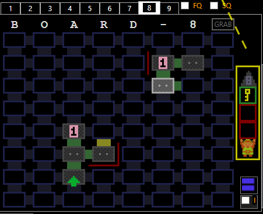

When your mouse is inside the dungeon map area, the location of that dungeon will be highlighted on the overworld map.

#### Doors

Doors between rooms are simple, and have four states:

 - dark gray is unknown (default)
 - green (left click) is "can go" (used for most kinds of doors/shutters/bombholes/etc)
 - red (right click) is "cannot go" (e.g. unbombable wall)
 - yellow (middle click) is "maybe" (you likely might use it for locked doors, or perhaps one-ways or shutters, up to you)

Clicking a door with its existing-state-mouse-button (e.g. left-clicking a green door) toggles it back into unknown gray.

#### Rooms

Dungeon rooms are somewhat complicated, as there is a lot of state you might want to track.  Read about them in [Dungeon Rooms section](#main-dr).

#### Multiple rooms at once

If you click-and-drag over the dungeon map with left mouse button, you can 'paint' a bunch of completed rooms by dragging over them.  
Same with right mouse button, but for uncompleted rooms.  
These features can be useful when you play part of a dungeon without mapping it, but then later decide you need to map it--quickly 'paint' what you have done.
Or if you enter a dungeon with a book-atlas-map, you might want to 'paint' the uncompleted dungeon rooms before starting.
Mouse-hovering the little blue bars near the bottom right corner of the dungeon tab will popup a display that mimics the in-game mini-map.  This can make it
easier to compare the rooms-you-have-painted to the actual in-game minimap, to spot any errors you may have made transcribing the map.

Sometimes you may mark up a bit of dungeon map, before noticing that (a portion of) your mapping is offset by a column.  You can click 'GRAB' in the corner 
of the dungeon map to switch to 'grab mode', which allows you to pick up entire segments of dungeon rooms and doors and move them at once (cut & paste) to 
fix an offset map.

#### Vanilla dungeon maps

Non-hidden dungeon numbers: FQ and SQ checkboxes will show First Quest or Second Quest outlines for that dungeon number.
Hidden dungeon numbers: 'FQ/SQ' button pops up all the vanilla dungeon shape outlines for you to choose from, with hover previews, and hinting which ones 
are compatible with your current room markup.

## <a id="main-dr"></a> Dungeon Rooms

Dungeon rooms are somewhat complicated, as there is a lot of state you might want to track.  You might want to utilize only a subset of the dungeon room features.

To motivate Z-Tracker's feature set, consider a dungeon room with a Digdogger, a floor drop of a bomb pack, and a push-block leading to a staircase basement
containing a key item like the Ladder.  Should this room be marked as a Digdogger room? A bomb pack room? An item staircase?  The salient information may change
over time, e.g.
 - you walk into the room the first time, and see Digdogger, a bomb pack on the floor, and a possible push block
 - you might want to leave the bomb pack, spend some bombs in adjoining rooms, and then return 90 seconds later to pick up the bomb pack
 - you might have to come back in 10 minutes with a recorder to defeat Digdogger, and try pushing the block, revealing the item staircase
 - you might be walking back through the room a couple minutes after that, and not be sure if you already tried pushing the pushblock

Z-Tracker supports four independent aspects of a given dungeon room:
 - RoomType          - the 'shape' or 'staircase info' of a room, examples including:
                            'empty room', 'room with possible pushblock', 'room with transport staircase 2', 'old man hint', 'hungry Goriya', 'chevy moat', ...
 - MonsterDetail     - information about boss monsters or bubbles in the room
 - FloorDropDetail   - what floor drop the room has, and whether you have already gotten it
 - Completedness     - are you 'done' with this room

As a result, in the scenario described before, you could mark up the room thusly:
 - upon entering the room, mark it as RoomType='possible pushblock', MonsterDetail=Digdogger, FloorDropDetail='bomb pack (ungotten)', Completed=no
 - after returning to grab bombs, you can toggle the 'gotten' of the FloorDropDetail
 - later when you kill Digdogger, you can mark the room Complete
 - upon discovering the item staircase, you could change the RoomType to 'item staircase'

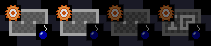

How much of this detail you choose to track is up to you, and the interface makes it easy to ignore details you don't care about.

If all you care about it 'what rooms have I been in, and what rooms have I completed', then all you need is left-click:
 - left-click an unmarked room to mark it as the default-RoomType, as a completed room - completed rooms have a dark outline
 - left-clicking a marked room toggles its 'completedness' - uncompleted rooms have a bright outline, to make them noticeable as a place to return to later


If you want to change a RoomType (to mark a transport staircase, hungry Goriya, chevy moat, ...), then right-click the room to bring up the RoomType popup:
 - a grid of 30 possible types of rooms appear
 - choose the one you want with your mouse, and left-click it

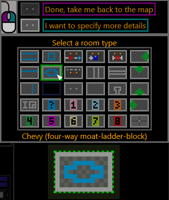

If you want to change the MonsterDetail or FloorDropDetail for a room, then right-click the room to bring up the RoomType popup, choose the room type, 
but this time right-click the RoomType selection to bring up the MonsterDetail/FloorDropDetail interface.  Click on details in the grids to apply them
to the current room's "preview" tile.  Once you are done, click the preview tile to save your edits to the dungeon map; a left-click marks the room completed,
and a right-click marks it uncompleted.  (After clicking a detail, its grid briefly goes half-transparent, as visual feedback that your detail has been applied
to the "preview" tile.  The half-transparent grid is another 'save' click-target, like the preview tile, with the implication that you can, for example, double-
right-click the Gleeok MonsterDetail as a way to say 'add a Gleeok to this room tile and immediately save this as an uncompleted room and exit the popup.)

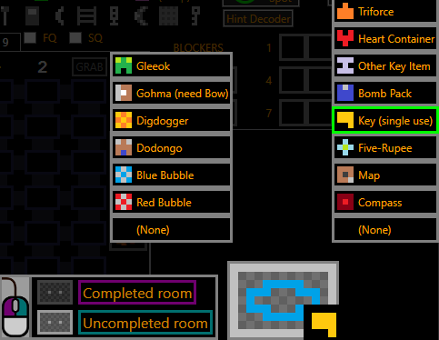

If you have marked a FloorDropDetail, you can toggle whether you have 'gotten' the floor drop by middle-clicking the room on the map.  Un-gotten floor drops
appear as a bright icon, and gotten floor drops appear darkened.

If a room does not have a FloorDropDetail, then middle-clicking will toggle a yellow 'circle' around the room.  This is an ad-hoc mark which you can use 
however you like, but one suggested use is to mark an un-gotten, unspecified floor drop item.  In my experience, it is very rare to intentionally "leave
behind" a floor drop to come back to later - the main exception is bomb packs.  As a result, if I leave a bomb pack behind, I'll just middle-click-
yellow-circle a room to quickly mark it, rather than go through the more cumbersome FloorDropDetail UI.  In the rare case where I leave something else behind,
such as an unreachable key in the middle of a circle-moat room when I don't have the ladder, then I use the FloorDropDetail UI to capture that specific bit
of information.  Another suggested use for the middle-click yellow circle is to mark rooms in 9 where you think Zelda or Ganon might be.

The MonsterDetail and FloorDropDetail information appear as tiny icons in the corners of rooms on the map.  If you want to briefly make these icons larger 
and see a legend, you can mouse-hover the checkbox in the very bottom right of the dungeon tab.  If you want to permanently keep the icons on their larger
size, click that checkbox.

While the vast majority of RoomType choices represent staircases (e.g. transport 2, item basement), NPCs (e.g. bomb ugrade, hungry Goriya), or geometry-
blockers (e.g. chutes, moats), there are also four special RoomTypes to mark the entrance to the dungeon, along with which direction you entered from.
As a convenience, the very first room you left-click on in the dungeon will automatically become the 'Dungeon entrance (from south)' tile, as this is the most 
common entrance direction, and furthermore, left-clicking any of the four 'entrance' tiles 'rotates the arrow' to the next cardinal direction, rather than
the usual left-click behavior of toggling completedness.  This way you can immediately mark the entrance tile and direction with some left clicks and
zero extra mousing.

There is one special RoomType, called OffTheMap.  This RoomType is displayed as a big black box over the room area, effectively making a 'hole' in the 
dungeon map.  The main scenario for using it is in e.g. Shapes 9 when you have an Atlas; when first entering the dungeon, rather than 'paint out' all the 
on-the-minimap rooms, it would be faster to just 'mark off the holes'.  RoomType.OffTheMap is not available in the room selection popup.  You can either use 
it by mapping a hotkey, or you can also select it by right clicking a room to bring up the popup, right clicking the Unmarked tile in the grid, and then 
right clicking the Unmarked preview-tile to save the room.  That is, triple-right-clicking an Unmarked room will turn it into OffTheMap.  An example of 
marking eight OffTheMap spots appears in this screenshot:


## <a id="main-blockers"></a> Blockers

This is an area you can optionally use to mark 'dungeon blockers', for scenarios where you cannot complete a dungeon now and need to return later.
You can mark up to 2 blockers per dungeon.  The icons have these suggested meanings:

 - Bow & Arrow: you need a bow and arrow (Gohma block, or maybe tons of Pols Voice)
 - Recorder:    you are blocked by Digdogger
 - Ladder:      there's a ladder block (moat)
 - Key:         you need more keys
 - Bait:        there's a hungry Goriya blocking you
 - Rupee:       you need money (e.g. to pay off a Money or Life mugger)
 - Bomb:        you need to find more explosion walls
 - Sword:       you need better combat gear (sword upgrade, ring upgrade, or maybe wand)

The list of all these icons appears in a popup.  In addition to scrolling, clicking a blocker box will activate the popup.  

For those players who want more fine-grained discrimination between **definitely** being blocked and **maybe** being blocked, there is a second set
of most icons on a green/red gradient background for denoting when you only might be blocked.


When possible, the tracker will give a reminder when you may be unblocked, for example, if you marked 5 with a ladder block, then when you obtain the ladder:

 - (WPF Only) voice reminder: "Now that you have the ladder, consider dungeon 5" 
 - visual reminder:  (ladder icon) (right-arrow) (dungeon 5 icon)

You can toggle whether you get these reminders in the [Options Menu](#main-om).

You cannot add a ladder/recorder/bow&arrow/key blocker if the tracker thinks you already have the corresponding items in your inventory .  This is to prevent 
the common mistake of e.g. the player forgetting they have the ladder, and then exiting a moat-ed dungeon and marking a ladder blocker.

When one of dungeons 1-8 is the currently selected dungeon tab, the corresponding blockers section gets a subtle highlight.


## <a id="main-notes"></a> Notes

This area is for ad-hoc text note-taking by the player (e.g. quickly type "5 BU 128" to remind you to return to level 5 to buy a Bomb Upgrade for 128 rupees).
Unlike scrap paper on your desk, these notes are visible to stream viewers.

If a file called Notes.txt exists in the program folder, the Notes box will be pre-populated with the text from that file.


## <a id="main-timeline"></a> Timeline

The timeline is an affordance, for e.g. viewers who watch a stream and arrive late, or for the player who finishes a seed and wants a retrospective of their game.
Every minute, the player's inventory (as captured in the top portion of the tracker) is read, and new items are posted to the timeline above the minute-marker.  
This makes it easy to look back and see e.g. that you got the wood sword in the 12th minute.

The timeline is non-interactive, it is just a display for capturing progress-over-time.  Here is a sample of how it appears:


## <a id="main-om"></a> Options Menu

Above the timeline, there is a button labeled "Options..."  Clicking this button the options menu to popup.

A variety of tracker features can be turned on and off here; mouse-hover the text of each for a detailed description.

Some randomizer flag settings are also featured here, notably 'Second quest dungeons' and 'Mirror overworld'.

The options pane automatically saves & closes when you click outside the pane, revealing the timeline once again.

Options are saved automatically to a JSON file, so that next time you use the tracker, it remembers your settings.


# <a id="speech-synthesis"></a> Speech Synthesis (voice reminders)

(WPF Only)

There are a variety of spoken reminders, which can be triggered based on the player's inventory, map progress, and time.  They are rather ad-hoc, stuff that helped Brian.
You can toggle various categories of voice reminders in the [Options Menu](#main-om).

Visual icons representing these spoken reminders appear in the upper right corner of the timeline, both on Windows and on Linux.
You can toggle various categories of visual reminders in the [Options Menu](#main-om).

# <a id="speech-recognition"></a> Speech Recognition

(WPF only)

When hovering over a blank overworld map tile, with a microphone equipped, you can speak aloud e.g. "tracker set bomb shop" to mark the current tile as a bomb shop.

This option must be enabled when first starting the tracker on the startup screen, it cannot be enabled later while the application is running.

The list of recognized phrases is below (code from WPFUI.fs).  You can speak a second shop item phrase to set a second item of a shop.
If 'Hide Dungeon Numbers' is enabled, just say "tracker set level" to select the next free dungeon letter A-H; "tracker set level nine" still works.

```
let wakePhrase = "tracker set"
                "level one"         , 0
                "level two"         , 1
                "level three"       , 2
                "level four"        , 3
                "level five"        , 4
                "level six"         , 5
                "level seven"       , 6
                "level eight"       , 7
                "level nine"        , 8
                "any road"          , 12  // 9 10 11 12
                "sword three"       , 13
                "sword two"         , 14
                "sword one"         , 15
                "arrow shop"        , 16
                "bomb shop"         , 17
                "book shop"         , 18
                "candle shop"       , 19
                "blue ring shop"    , 20
                "meat shop"         , 21
                "key shop"          , 22
                "shield shop"       , 23
                "unknown secret"    , 24
                "large secret"      , 25
                "medium secret"     , 26
                "small secret"      , 27
                "door repair"       , 28
                "money making game" , 29
                "the letter"        , 30
                "arm owes" (*armos*), 31
                "hint shop"         , 32
                "take any"          , 33
                "potion shop"       , 34
```
