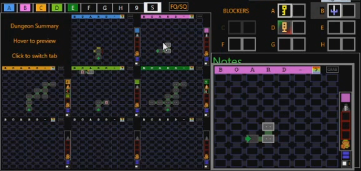
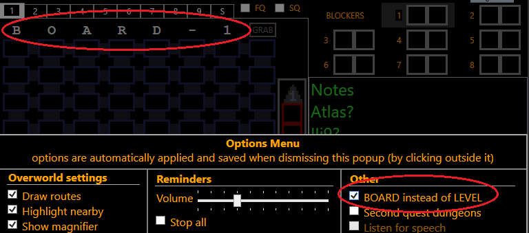
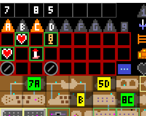
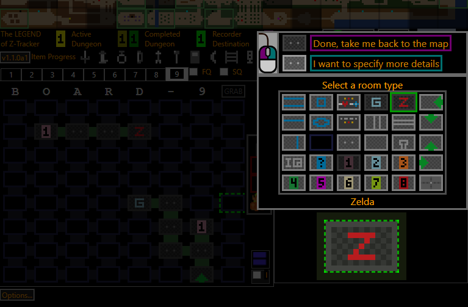

# What's new in this version

A summary of the features/fixes in the various releases of Z-Tracker

## Version 1.1

### Starting Items and  Extra Drops

You can now track items obtained outside the usual places, see [the documentation](use.md#main-sioed) for details.

### Dungeon Summary Tab

The dungeon tracker now has a tab showing the tracking of the first 8 dungeons on a single screen:

### Maybe-blockers

There's now an option to distinguish "definitely" and "maybe" in the BLOCKERS sections.  See [the documentation](use.md#main-blockers) for details.

### BOARD instead of LEVEL

In the options menu, you can now choose BOARD instead of LEVEL for column headers, just like in the randomizer.

### Hidden dungeon numbers shows known numbers on the overworld map

If the dungeon number is known, both the number and letter appear on the overworld map

### Gannon and Zelda rooms in dungeon 9

New room options for the final dungeon (that replace Bomb Upgrade and Meat Block in L9)

### Highlight empty item boxes

In the item box popup, whereas middle-clicking an item marks that item as intentionally skipped, now middle-clicking the empty box toggles the
box outline between red and white.  You can use this white box outline mark however you like, e.g. to highlight a high-priority dungeon item 
to find ("I never found the stair item in 3, remember to come back there soon").  

By default, the white sword, ladder, and armos item boxes start out with this white highlight.

### Other minor stuff

A number of minor improvements:
 - there's now a legend under the overworld magnifier
 - the current dungeon tab highlights corresponding blockers area
 - dungeon doors/rooms give mouseover feedback, to make it easier to click the intended target
 - 'Show HotKeys' window remembers its size/location
 - added Z-Tracker logo next to the kitty
 - big icons checkbox in dungeons is persisted across sessions
 - The file Notes.txt can be used as the default Notes text at startup

 And some small fixes:
 - fix GRAB getting triggered when clicking dungeon tab then pressing Enter
 - fix 2Q overworld not showing fairy icon at 1Q5

## Version 1.0

Original Release (see [full documentation for v1.0](https://github.com/brianmcn/Zelda1RandoTools/blob/v1.0/doc/TOC.md))