# What's new in each version

A summary of the features/fixes in the various releases of Z-Tracker

 - [Version 1.3.1](#v1.3.1) (released TBD)
 - [Version 1.2.3](#v1.2.3) (released 2022-08-15)
 - [Version 1.2.2](#v1.2.2) (released 2022-05-31)
 - [Version 1.1](#v1.1) (released 2022-02-06)
 - [Version 1.0](#v1.0) (released 2021-12-11)

## Version 1.3.1

This is a major update with a number of usability improvements and new features.

 - [Alternate app size](#v13-alt-size)
 - [Navigation hotkeys](#v13-hotkeys)
 - [Reset buttons](#v13-reset)
 - [Recorder Destination options](#v13-recorder)
 - [Highlight open caves checkbox](#v13-open-caves)
 - [New Dungeon Summary Tab layouts](#v13-summary-tab)
 - [New Monster choices](#v13-monsters)
 - [Mirror-overworld and 2nd-quest-dungeons toggles](#v13-mirror)
 - [Faster map region hints](#v13-fast-hint)
 - ["Have I found X yet" at a glance](#v13-glance-found)
 - [A bunch of other stuff](#v13-other-stuff)

### <a id="v13-alt-size">Alternate app size</a>

You can now choose either "Tall" (default) or "Square" application size, via "Click here for options" bar at the very top of the startup screen.

These screenshots show the default tall app, the square app when the mouse is in the overworld, and the square app when then mouse is in the dungeon.

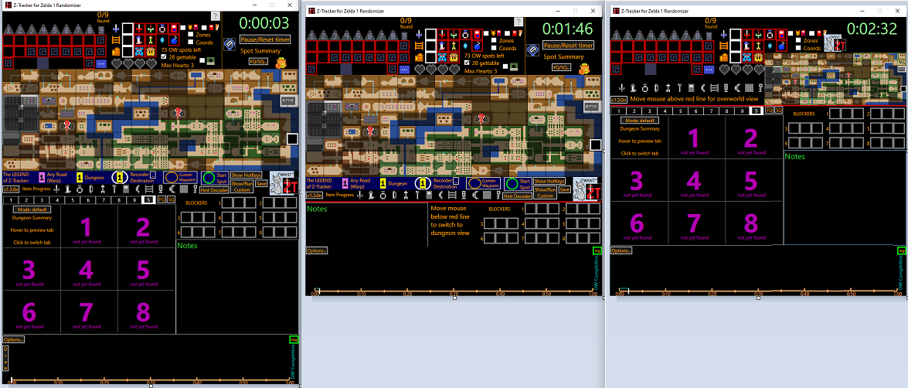

### <a id="v13-hotkeys">Navigation hotkeys</a>

You can now navigate a great deal of the app without touching the mouse, if desired:

- You can now map 4 "arrow" hotkeys, which can be used to navigate most grids (overworld, dungeon rooms, ...) as an alternative to moving the mouse
- You can now map keyboard keys to mean 'left click, middle click, right click, scroll up, or scroll down'.
- You can now map hotkeys with 1 optional modifier (SHIFT/ALT/CTRL)

Users of prior versions of Z-Tracker can simply copy over their existing "HotKeys.txt" file into the new install folder.  Then inspect the file
"HotKeys_BlankSampleTemplate.txt" to learn about new hotkey options (at the bottoms of the Global_ and DungeonRoom_ sections), and then edit your
HotKeys.txt to add your own.

### <a id="v13-reset">Reset buttons</a>

There are now four options on the pause menu:

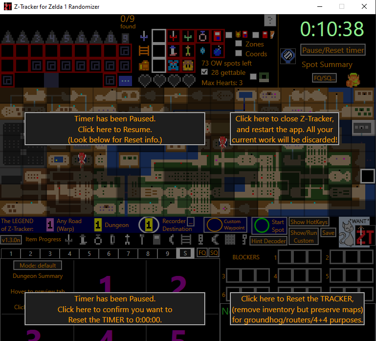

Use the bottom left button as you press Start on your controller to start a race.

You might use the upper right button when you have completed one seed and immediately want to run a new one back-to-back.

You can use the bottom right button when you are re-running a seed; it will preserve your map/tracking but reset your inventory in the
top of the tracker so that no items have yet been obtained.

### <a id="v13-recorder">Recorder Destination options</a>

Click the "..." button near "Recorder Destination" in the LEGEND to bring up these options:

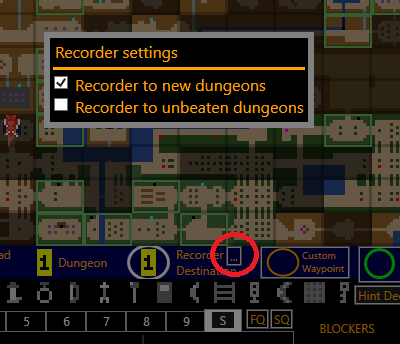

These correspond to the equivalent flags in the randomizer.

### <a id="v13-open-caves">Highlight open caves checkbox</a>

Click the checkbox next to the open caves icon in the top of the tracker (circled below) to distinguish open caves with a cyan highlight:

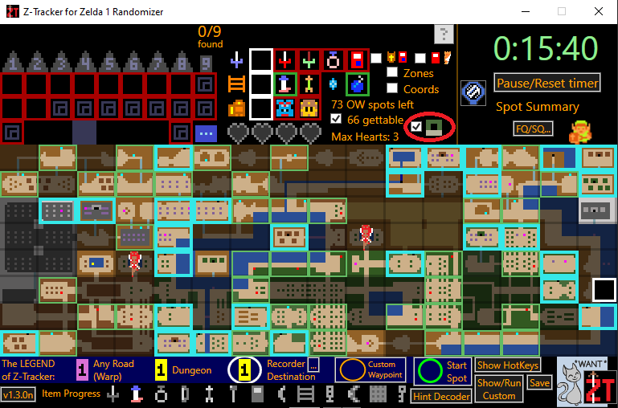

This can be useful when you are still looking for the wood sword but also burning bushes and bombing walls along the way.  These cyan 
highlights disappear once you obtain a sword.

If you obtain a sword but don't yet have the armos item, the tracker will switch to highlighting only unmarked armos spots cyan.

### <a id="v13-summary-tab">New Dungeon Summary Tab layouts</a>

TODO screenshots and explanation

### <a id="v13-monsters">New Monster choices</a>

Many more choices have been added to the MonsterDetail popup (when you scroll-up on a Dungeon Room):

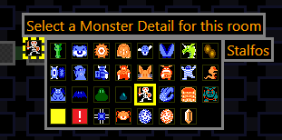

### <a id="v13-mirror">Mirror-overworld and 2nd-quest-dungeons toggles</a>

The Mirror Overworld option has moved out of the Options Menu, and now appears as a mirror icon at the top of the app (circled in red, below).

The Second Quest Dungeons toggle has moved out of the Options Menu, and now appears when hovering and then clicking the blank spot under dungeon 4 or 1 (pointed at by blue arrow, below).

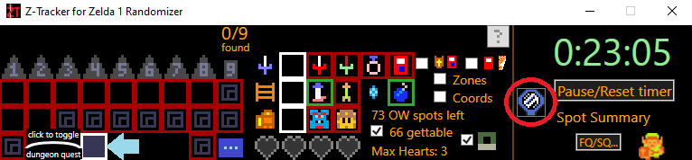

### <a id="v13-fast-hint">Faster map region hints</a>

For those who don't need the "Hint Decoder" button to know that "Manhandla Threatens" means Dungeon 3, you can mark map-region-hints directly by mouse-scrolling the
blank areas above the triforces, above the dungeon 9 numeral, above white sword icon, and above the magical sword box:

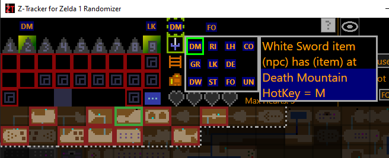

There are new hotkeys for hint zones, which are applied when the mouse is hovering these areas.

This feature is only when not using Hidden Dungeon Numbers (as those portions of the screen have other uses when that setting is on).

### <a id="v13-glance-found">"Have I found X yet" at a glance</a>

For those thinking "I have 246 rupees, have I even found the blue ring shop yet?" the tracker is even more helpful than before.

You can always mouse-hover the blue-ring icon, and any blue-ring shops you have mark on the overworld map will be displayed.

But now, you can also just glance at the tracker to answer to question:

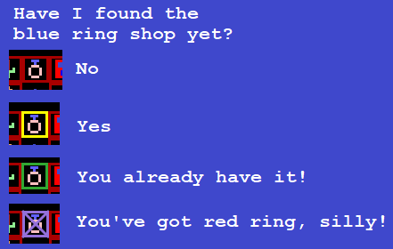

Similar effects happen on all these boxes: magical sword, wood sword, blue ring, boomstick book, blue candle, wood arrow, bombs.

### <a id="v13-other-stuff">A bunch of other stuff</a>

- usability: the clickable stuff now gives mouse-hover feedback to make it clearer it's clickable
- added Custom Waypoint, basically like a second Start Spot icon--you only get one, and you can place/move it how you like, click the button in LEGEND
- mouse magnifier window, in Options Menu
- hide timer option, in Options Menu
- added an option to hide meat shops, deep in the overworld Options Menu
- FQ/SQ buttons in corner of dungeon tracker now update front half (1-6) and back half (7-9) vanilla maps all at once, rather than per-dungeon
- improved BLOCKERS hover feedback and explanation of 'possible dungeon continuations'
- book-is-atlas checkbox in upper right of app; checkmarks to note if got map in each dungeon; have-map displayed in new summary tab
- added vanilla dungeon items reference diagram to the '...' starting/extra items popup
- FQ/SQ... button to permanently mark off HFQ/HSQ stuff, or to mark vanilla FQ/SQ dungeon locations
- after finishing and clicking zelda, dungeon 9 appears on the summary tab for most-recent-completion-full-screenshot.png to see everything
- can choose a different voice for spoken reminders, if installed
- hovering Hint Decoder button shows locations of hint shops marked on overworld map
- hovering dungeon icon in LEGEND shows locations of all dungeons, just like hovering 'S' summary tab header does
- Blockers numerals turn white when the corresponding dungeon is located on the overworld
- new rupee icon in upper right, hovering it (or money blocker in blockers) shows all MMGs, Unknown Secrets, or un-taken Secrets
- new reminder for Overworld Overwrites (if you make a mark, and then change it)
- new reminder "log": click log button at upper right of timeline to see past reminders (can mouseover each for description)
- new eyeball icon in upper right, hover to hide overworld map icons (to see unobscured map)
- hidden setting UseBlurEffect, set it to false if using the "Coords" checkbox causes the whole app to get super laggy (due to BlurEffect rendering in software rather than hardware)
- dungeon rooms: unpaired transport numerals light up
- improved Door Inference option
- display if potion letter obtained (based on overworld map markup, displays right of bomb icon)
- a few more hover "explainers" (e.g. on startup screen) to help out folks who are new to the game
- a lot of improvements to crispness of art/images when using 2/3 size mode
- new option to turn off Dungeon 'sunglasses', to make dungeon tracker use brighter colors/higher contrast
- a lot of small fixes
- a lot of performance improvements (for best performance on very low-end machines, use Tall window layout and turn off both "Draw Routes" and "Highlight Nearby")

---

## Version 1.2.3

This is a minor update with some small features and bug fixes:

 - label timeline hearts with their origin (e.g. '3' from dungeon 3, 'sword icon' from white sword cave...)
 - "S/B" is now shield/book icons instead
 - can attempt to load saves from older versions (1.2.3 can load 1.2.2 saves)
 - FQ/SQ vanilla dungeon shapes now have a 'hatch' pattern off-the-map (to make 2Q7 and 2Q8 more visually distinct)
 - while painting dungeon map, popup the blue-bars-hover-thingy
 - Options Menu ability to hide no-longer-relevant shop items on overworld map (under "More settings...", final checkbox)
 - Options Menu new dungeon option "Left-drag auto-inverts" causes first left-click-drag to auto-click OffTheMap/Unmarked button in bottom right, for immediately painting rooms back onto the map
 - Options Menu new dungeon option "Default to NonDescript" if you want left clicking a room to be NonDescript rather than MaybePushBlock
 - fix a couple timeline OW graph draw bugs
 - fix a couple crash bugs
 - fix bug: in 2Q, voice says 10/10 door repair, but visual reminder says 10/9
 - fix bug: 2nd quest map has yellow dot on A9 rather than A7
 - fix bug: The "SQ" button to pre-highlight the dungeons with vanilla 1Q/2Q shapes only works correctly if "S" is selected; if any dungeon 1-9 is being displayed, "SQ" acts exactly like "FQ"
 - fix bug: toggling "Second quest dungeons" does not update old man counts

## Version 1.2.2

### Save and load

You can now save the state of the tracker to a file, and load it again (say, tomorrow) to pick up a seed where you left off.

Click the 'Save' button in the running tracker to save all of the current tracker state; it will automatically be saved to a file with the current date and time in the filename.

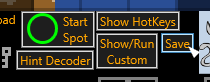

On the startup screen, choose the 'Start: from a previously saved state' option to load up a prior save.

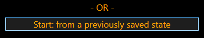

There is also an auto-save which saves the full tracker state (to a file named 'zt-save-zz-autosave.json') approximately every minute.  This might be useful if you accidentally 
close the tracker or have a crash in the middle of a seed.

There's also an option in the Options Menu to 'Save on completion', to automatically make a save when you click Zelda upon completion of the seed.  This can be useful to folks who
like to keep records of all their Timeline splits for each game played.  (Note that the save files are large, so ensure you have plenty of disk space if you use this option to 
accumulate a lot of saves.)

### Dungeon numerals stay visible until first room is marked

To make it less likely to accidentally map a dungeon in the wrong tab, the dungeon numeral stays visible over the whole tab until the first room is marked.

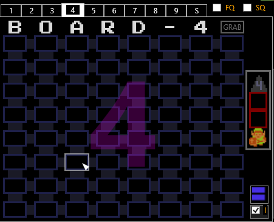

### More types of dungeon rooms and monsters; Simpler UI for choosing rooms, Monster Detail, and Floor Drop Detail

The dungeon room shape "Lava Moat" has been added, and now the existing room types "Bomb Upgrade", "Hungry Goriya", "Gannon", "Zelda", and "Off the map" are now
always available in the dungeon room selection popup menu.  

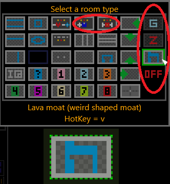

Many more monster types can be optionally marked in a room:

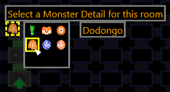

For details, see the [main documentation](use.md#main-drpu) on this topic.

### Special NPC room highlights

You can make Bomb-Upgrade rooms and NPC-with-Hint rooms stand out visually, and surface the existence of these rooms and Hungry-Goriya-Bait-Block rooms in the tab headers:

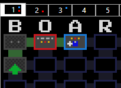

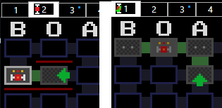

See [Special NPC rooms](use.md#main-dungeon-special-rooms) for details.

### Vanilla dungeon map improvements

The user interface and colors for the vanilla dungeon maps overlay has been improved.

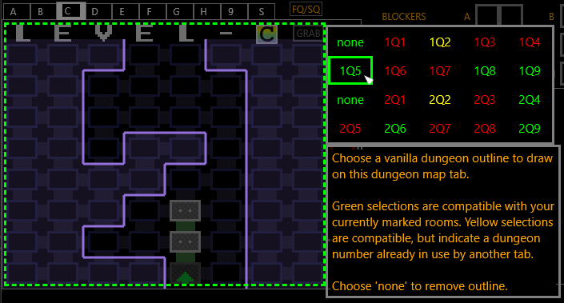

### Highlight potential dungeon continuations

This is a new feature to help locate paths to the rest of the rooms in a dungeon, see [here](use.md#main-hpdc) for details.

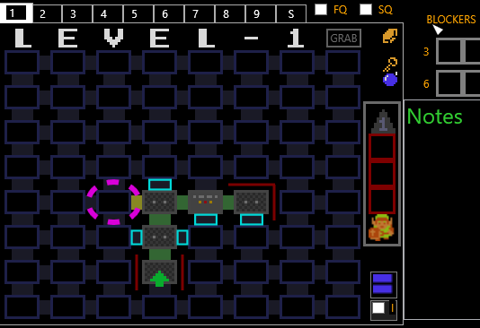

### Circle arbitrary overworld tiles

You can now circle arbitrary overworld spots (perhaps to remind you of a screen with easy-to-kill bomb-droppers).  You can even add some labels and colors to these marks
(you might want this if using Z-Tracker to play other randomizer variants, such as z1m1, for example).  See [the full documentation](use.md#circle-overworld) for details.

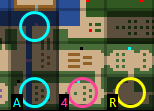

### LostWoods/LostHills magnifier improvements

The Lost Woods tile and Lost Hills tile now show the routes to traverse these 'maze' tiles on the overworld magnifier.  This is to help both Zelda 1 novice players, as well as
veterans who may get confused/disoriented when playing using the rando flag "Mirror Overworld".

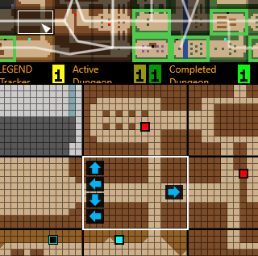

### Timeline improvements

Many changes and improvements:

 - The timeline now updates instantly as you get items, rather than only updating once per minute.  The splits for each item/triforce are stored at one-second granularity and can
be seen by mouse-hovering a particular item in the timeline.  

 - In 'Hidden Dungeon Numbers', lettered triforces will now change to numbered ones on the timeline after the numbers are known.  
 
 - Items marked as 'skipped' (by middle-clicking them) now show up in the timeline ('X'-ed out, as in the top-tracker).

 - There are now more time labels on the timeline, making it easier to read.

 - The timeline now shows a graph of 'overworld progress over time' in its background, showing the trend of the 'remaining unmarked overworld spots' counting towards 0 at the top of the graph.

 - When you click Zelda to finish the seed, your final time and final number of remaining unmarked overworld spots appear on the timeline, and a screenshot of the timeline is taken and 
saved as "most-recent-completion-timeline.png" in your Z-Tracker directory, which you might share in a race-spoilers discussion.

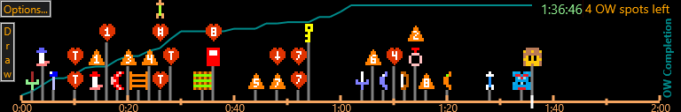

### More application sizes

On the startup screen, the top banner used to allow changing the application to run either at full size (default) or at 2/3 size (for some laptops/tablets where Z-Tracker couldn't fit on the screen).  
Now there is third option of 5/6 size; furthermore, by manually editting the json settings file, you could try other arbitrary sizes as well (though they may not look very good due to pixel scaling issues).

### Changed-tile animations

You might sometimes accidentally click/hotkey an overworld tile or dungeon room that you didn't mean to change, and you might not notice/see which tile you just changed.  There is now an option to 
"Animate tile changes" in the Options Menu which causes a brief highlight animation over the most-recently-changed overworld tile or dungeon room.

### HotKey improvements

Now most popup menus will remind you of HotKeys you have mapped in the descriptions of the corresponding items.  This is useful for the scenario where you know that you mapped a HotKey for
a certain item, but you forget what you set it to.  

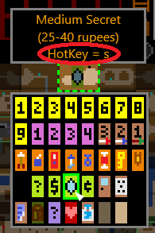

Also, you can now map 'global' hotkeys to toggle items in the upper right of the tracker (e.g. wood arrow, bomb, zelda), or to switch among the 10 dungeon tabs.

Plus, you can now hotkey the 'Take Any' (heart) and 'Take This' (wood sword) cave options.

Furthermore, you can now bind any keyboard keys (not just 0-9/A-Z).  See [HotKeys](extras.md#hotkeys) for details.

### A number of minor fixes and changes

 - fixed: mini-mini-map (the dungeon hover-blue-bars) now shows text like "BOARD-5" properly, no longer obscures dungeon map
 - fixed: dungeon summary tab no longer sometime shows stale/missing info
 - fixed: fewer reminders to "consider dungeon X" when you're already inside dungeon X right now
 - fixed: clicking FQ or SQ on the dungeon summary tab (in non-hidden-dungeon-numbers) toggles all dungeons consistently into that vanilla map display
 - fixed: issues with image crispness in Broadcast Window
 - you can now mark up to 3 Blockers per dungeon
 - hovering certain blockers (bait/key/bomb/bow&arrow) will highlight the corresponding marked shops on the overworld map
 - hovering to highlight shops can animate tiles to make them easier to see (OptionsMenu: "Animate Shop Highlights", on by default)
 - Link can now route to blocker-shops (e.g. bait/key blocker), or to potion shops (Link's potion shop icon appears over take-any hearts)
 - made dungeon LEVEL/BOARD header use Zelda font
 - there's now a 5th [dungeon door state](use.md#main-dt-doors) (purple) which you can optionally use to distinguish shutters from key-locked-doors, or whatnot
 - dungeons show an [old man count](use.md#main-dungeon-old-man-count), tracking the number of NPC rooms you have marked versus the expect number (e.g. "OM:2/3")
 - mouse hovering a dungeon room shows a helpful row-locator graphic in the corner, see [Row location assistance](use.md#main-dungeon-row-location) for details
 - if you mark any off-the-map rooms, mouse hovering the little blue bars in the corner of the dungeon tracker will also display the 'inverse map' (when painting 'holes' upon entering 9 with atlas)
 - when on the dungeon summary tab, all dungeon locations get a thick green highlight on the overworld map, to make it easy to see all dungeon locations at once
 - an empty dungeon item box display suggests whether it is a basement item or standing/floor drop ('Show basement info' in the Options Menu; 'on' by default)
 - speaking either "don't care" or "nothing" will mark off an overworld tile using [Speech Recognition](use.md#speech-recognition)
 - when you get a reminder to consider the magical sword, tracker now briefly highlights its location on the map
 - when you get the 8th triforce piece, reminder that dungeon 9 is unlocked now briefly highlights the location of dungeon 9
 - there's now reminders for Door Repair Count on the Options Menu
 - you can now choose to hide certain overworld icons you don't want to see (Options Menu\Overworld\More settings)
 - when you reset the timer, you immediately get put into the 'place the start spot location icon' popup to mark your start screen
 - new dungeon map drag-painting implementation, see [full documentation](use.md#main-dr-drag) for details
 - Show/Run Custom button now can 'RUN' URLs, which get launched in your default browser
 - you can have tracker snoop for window (e.g. emulator window) whose title contains seed & flags, and display/save that info
 - reconfigured top right area of tracker to improve Broadcast Window view while in dungeons
 - improved readability of 'Coords' display
 - recorder destination in map legend is now clickable, to cycle dungeon numbers 1-8, to optionally keep track of where you just recordered to

---

## Version 1.1

### Starting Items and Extra Drops

You can now track items obtained outside the usual places, see [the documentation](use.md#main-sioed) for details.

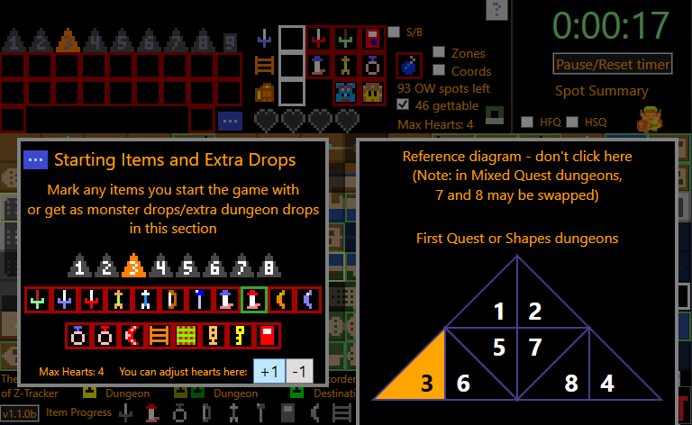

### Dungeon Summary Tab

The dungeon tracker now has a tab showing the tracking of the first 8 dungeons on a single screen:

### Maybe-blockers

There's now an option to distinguish "definitely" and "maybe" in the BLOCKERS sections.  See [the documentation](use.md#main-blockers) for details.

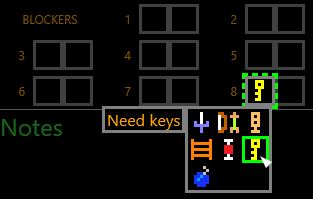

### BOARD instead of LEVEL

In the options menu, you can now choose BOARD instead of LEVEL for column headers, just like in the randomizer.

### Improvements to ''Hidden Dungeon Numbers' support

If the dungeon number is known, both the number and letter appear on the overworld map.

Hotkeys: Pressing keyboard keys 1-8, either in the Number chooser, or when hovering a lettered triforce or its number button, will set the number for that dungeon.

If the dungeon number is known, and that dungeon only has two items rather than three, the third item box is automatically marked off with a 'ghostbusters' (circle/slash) icon.

### Gannon and Zelda rooms in dungeon 9

New room options for the final dungeon (that replace Bomb Upgrade and Meat Block in L9)

### Highlight empty item boxes

In the item box popup, whereas middle-clicking an item marks that item as intentionally skipped, now middle-clicking the empty box toggles the
box outline between red and white.  You can use this white box outline mark however you like, e.g. to highlight a high-priority dungeon item 
to find ("I never found the stair item in 3, remember to come back there soon").  

By default, the white sword, ladder, and armos item boxes start out with this white highlight.

### Mouse hover explainer

There are a lot of places in the app where hovering the mouse over something can display useful information.  Now you can learn about all of
these mouse-hover targets inside the app, by hovering the question mark left of the game timer at the top of the app.  When you move the mouse 
over the question mark, the diagram below appears:

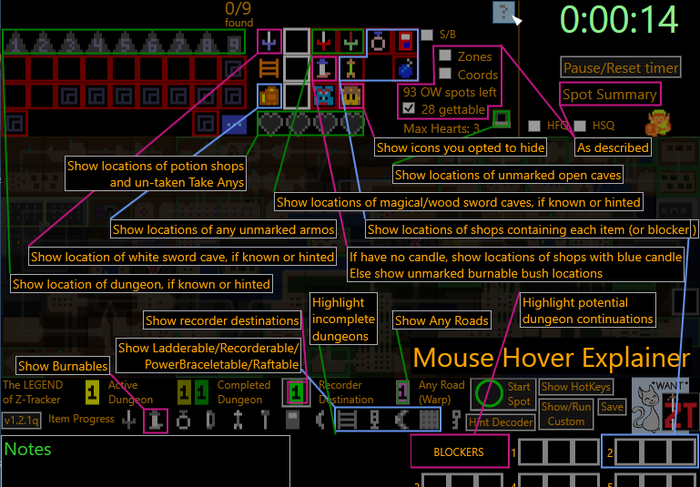

### Other minor stuff

A number of minor improvements:
 - there's now a legend under the overworld magnifier
 - there's now an option for overworld-routing to show & utilize screen scrolling
 - the current dungeon tab highlights corresponding blockers area
 - dungeon doors/rooms give mouseover feedback, to make it easier to click the intended target
 - there's an option to automatically infer some dungeon door marks (see [the documentation](use.md#main-dt) for Doors)
 - main application window and broadcast window remember their locations
 - 'Show HotKeys' window remembers its size/location
 - a count of how many dungeon entrances you have already found appears at the top of the tracker
 - added Z-Tracker logo next to the kitty
 - big icons checkbox in dungeons is persisted across sessions
 - The file Notes.txt can be used as the default Notes text at startup
 - The rest of the Helpful hints (ones that don't lead to dungeon/sword) have been added to the Hint Decoder
 - you can now change between 'Default' and '2/3 size' main window in the application (on the startup screen)
 - when you change dungeon tabs, or first mark a room in a dungeon, the dungeon number appears briefly on the tab to remind you which tab you are on, to help prevent the error of mapping in the wrong tab
 - there's a new reminder if you are still missing the white sword cave when you locate the 9th dungeon
 - there's a new button 'Show/Run Custom' which can be used to script SHOWing some image windows or RUNning executables, see [the documentation](use.md#main-buttons) for more info
 - the currently running version number now appears on the startup screen

 And some small fixes:
 - fix GRAB getting triggered when clicking dungeon tab then pressing Enter
 - fix 2Q overworld not showing fairy icon at 1Q5
 - fix coordinate display in Mirror Overworld to match z1r spoiler log format
 - fix HFQ/HSQ buttons to be more useful and to display less ugly
 - fix windows/taskbar to now properly display Z-Tracker logo icon

---

## Version 1.0

Original Release (see [full documentation for v1.0](https://github.com/brianmcn/Zelda1RandoTools/blob/v1.0/doc/TOC.md))